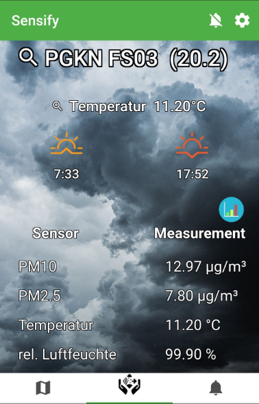

  

Sensify is a multifaceted app that uses the openSenseMap API to bring SenseBox data to your daily life. It uses the data from nearby outdoor SenseBoxes to present you the latest climate and weather data based on the user’s GPS location. Many customizable options allow you not only to specify a personal SenseBoxes and preferences, but also to get real-time push notification about special weather events. 

## Getting Started 

You can simply try out Sensify by downloading the ready-to-use APK or build you own! 

- Prebuild APK 
    - apk/app-debug.apk   More information on how to install third-party-apps can be found [here!](https://www.wikihow.tech/Install-APK-Files-on-Android)

- build apps with
    - -ionic cordova build --debug android

## Features:
- SenseBox Data   On the Sensify homepage you will find all available information about a SenseBox clearly arranged. In addition, the sunrise and sunset are displayed, as are the values of the selected sensor for the last 30 days.  
- SenseBox data verification   SenseBox Sensor values are verified by comparing them to sensor values of neighboring SenseBoxes with same day data.
- Notification-Service   Measured values are again tested against set thresholds after successful data verification. If a measured value is tested positive against a threshold value, a push notification is generated.   User-specific thresholds for temperature and UV intensity can be set in the settings. 
- Location based Optimizations   The position of a user can be automatically determined using the internal GPS sensor of a smartphone or can be set in manually. Using a precise GPS position it is possible to minimize the data traffic between smartphones and the openSenseMap.
- Minimal data Usage   The openSenseMap offers an interface for spatial querying of sense boxes by using a bounding box. Sensify uses this query to query only those SenseBoxes which offer relevant data for the user, selected through the verification.   The bounding box is calculated from the stored location of a user and a radius, which is set in the settings. Also, as long as the current stored GPS position of a user does not shift by at least half the stored radius, new data will not be requested from the openSenseMap.   Combining the spatial bounding box query and the special ensures that the data traffic is kept as minimal as possible. 

## Prequesites 

- Node + NPM (nvm) 
    - https://www.npmjs.com/get-npm
    - preferably use the latest 8.x.x release 
    
- IONIC CLI & cordova
    - https://ionicframework.com/docs/intro/installation/

- To start this project run:
    - npm install
    - ionic serve
    
## Further Information:
- [<b>re:</b>edu](https://reedu.de/)
- [ifgi](https://www.uni-muenster.de/Geoinformatics/)
- [senseBox](https://sensebox.de/)

    

